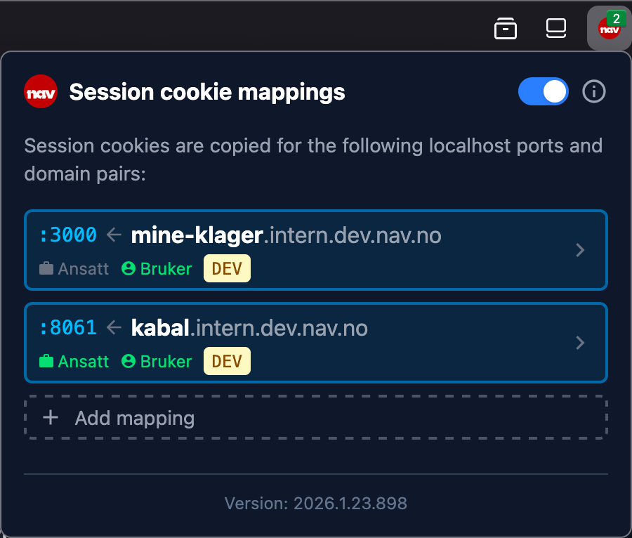

# Nav Dev Sessions Extension

Browser extension that copies session cookies to requests for easier development against `dev` and `prod` environments, from a `localhost` environment.

## Firefox
[-FF7139?logo=firefox-browser&logoColor=white)](https://github.com/cskrov/nav-dev-sessions-extension/releases/latest/download/nav_dev_sessions_extension-firefox.xpi)

_Single-click install and automatic updates!_

## Chrome and Edge
[-4285F4?logo=googlechrome&logoColor=white)](https://github.com/cskrov/nav-dev-sessions-extension/releases/latest/download/nav_dev_sessions_extension-chrome.zip)
[-0078D7)](https://github.com/cskrov/nav-dev-sessions-extension/releases/latest/download/nav_dev_sessions_extension-edge.zip)

1. Download
2. Unzip
3. Go to `chrome://extensions` or `edge://extensions`
4. Enable developer mode
5. Click "Load unpacked"
6. Select `manifest.json`

## Requirements
- Your application in NAIS must offer the endpoints needed by your local application.
   - Proxy requests to any API endpoints used by your application.
- Your local development server must proxy requests to NAIS.

### Vite example
```js
  server: {
    proxy: {
      '/api': {
        target: 'https://your-app.intern.dev.nav.no',
        changeOrigin: true,
      },
    },
  },
```

## How to use
1. Install the extension for your browser (Firefox, Chrome, or Edge).
2. Open `dev` or `prod` in one tab and log in.
3. Open your `localhost:<port>` application in another tab.
4. Add a mapping from the `dev` or `prod` domain to `localhost:<port>`.
    - The extension will detect the last active `localhost` port automatically.
5. Enjoy seamless authentication for your `localhost` application!
    - Continue to use `dev` or `prod` in the first tab as normal.

## Features
- Allows multiple `localhost` ports to be mapped at the same time.
- Detects the last active `localhost` port automatically when adding new mappings.
- Remembers which domains are associated with which `localhost` ports.
- Allows easy switching between domains for different `localhost` ports.
- Mappings can be removed when no longer needed.
- The whole extension can easily be disabled/enabled with a single click.

## Screenshot


## Copied cookies
- `io.nais.wonderwall.session` - Employee session cookie (works on all `*.nav.no` domains)
- `sso-dev.nav.no` - End user session cookie for `dev` domains (`*.dev.nav.no`)
- `sso-nav.no` - End user session cookie for `prod` domains (`*.nav.no`, excluding `*.dev.nav.no`)

## Domains covered
All requests to mapped `localhost` ports will have the session cookies added.

### Only if mapped from dev domain
- `login.ekstern.dev.nav.no`
- `dekoratoren.ekstern.dev.nav.no`

### Only if mapped from prod domain
- `login.nav.no`
- `www.nav.no`

## Why make this extension?
Manually moving or copying session cookies from `dev` or `prod` to `localhost` is a hassle.
The easiest way is to change the domain of the session cookie, which moves the cookie from `*.dev.nav.no` or `*.nav.no` to `localhost`.

Moving is especially problematic because `dev`/`prod` will set a new session cookie for `*.dev.nav.no` or `*.nav.no`, and invalidate the session cookie for `localhost` the next time you interact with `dev`/`prod`.

This extension automatically adds the session cookies from `dev`/`prod` to all requests to `localhost`. You can and should have both `dev`/`prod` and `localhost` open at the same time.

## Build

1. Install [Bun](https://bun.sh)
2. Install dependencies - `bun i`
3. Build the extension - `bun run build`

The built extension will be in the `/dist` directory.

## Package
_You must build the extension before packaging it._

### Firefox
`bun run firefox:pack`

### Chrome
`bun run chrome:pack`

### Edge
`bun run edge:pack`

The packed extension will be in the `/dist` directory.

## Sign
### Firefox
`WEB_EXT_API_KEY` and `WEB_EXT_API_SECRET` can be obtained from the [Firefox Add-on Developer Hub](https://addons.mozilla.org/en-US/developers/addon/api/key/).
