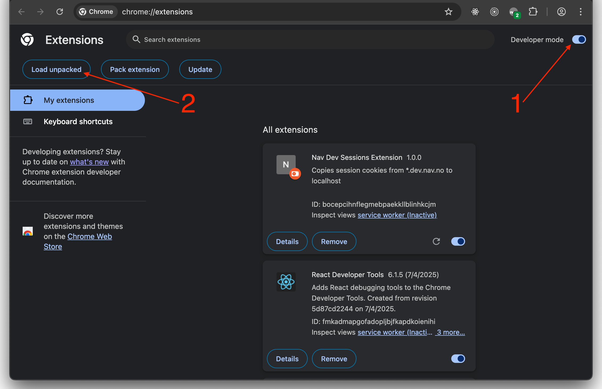
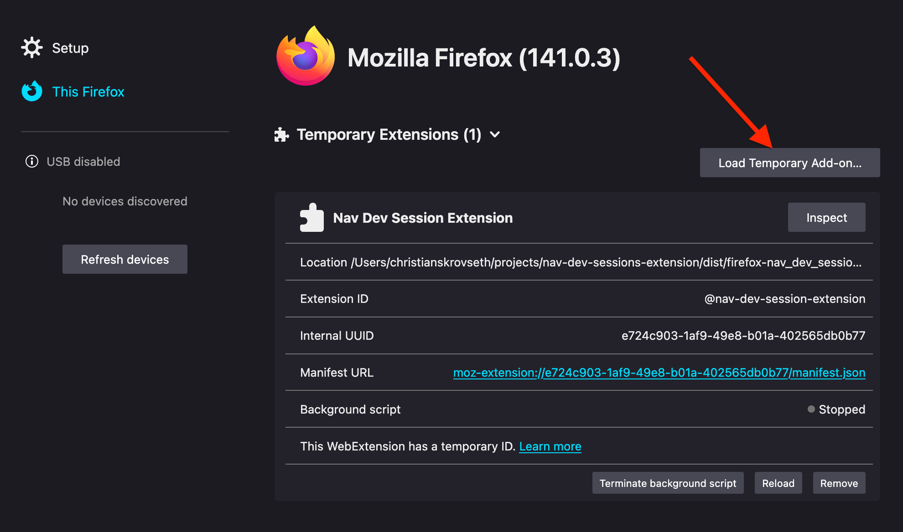

# Nav Dev Session Extension

Browser extension that adds session cookies to requests to `localhost`:
- `io.nais.wonderwall.session` - Employee session cookie (works on all `*.nav.no` domains)
- `sso-dev.nav.no` - End user session cookie for `dev` domains (`*.dev.nav.no`)
- `sso-nav.no` - End user session cookie for `prod` domains (`*.nav.no`, excluding `*.dev.nav.no`)

## Why make this extension?
Manually moving or copying session cookies from `dev` to `localhost` is a hassle.
The easiest way is to change the domain of the session cookie, which moves the cookie from `*.dev.nav.no` to `localhost`.

Moving is especially problematic because `dev` will set a new session cookie for `*.dev.nav.no`, and invalidate the session cookie for `localhost` the next time you interact with `dev`.

This extension automatically adds the session cookies from `dev` to all requests to `localhost`. You can and should have both `dev` and `localhost` open at the same time.

## How to use this extension?

1. Download the latest version of the extension from the [releases page](https://github.com/christianskrovseth/nav-dev-sessions-extension/releases).

### Chrome
1. Go to [Chrome's Extensions page](chrome://extensions).
2. Enable "Developer mode" in the top right corner.
3. Extract the downloaded ZIP file to a folder.
4. Click "Load unpacked" and select the folder where the extension is located.
5. Pin the extension to the toolbar (optional).

### Firefox :wrench:
_Firefox appears to restrict the ability to interact with cookies the way this extension needs to. However, there is a release for Firefox available if you want to try it yourself._

1. Go to Firefox's Add-ons page: `about:addons`.
2. Click the cog icon in the top right corner.
3. Select "Debug Add-ons". A new tab will open: "Debugging - this-firefox" `about:debugging#/runtime/this-firefox`.
4. Click "Load Temporary Add-on" and select the downloaded ZIP file.

_Firefox requires extensions to be signed for proper installation. I have not invested time in this, as the extension does not currently work within the cookie restrictions in Firefox._

#### TODO
- Look into alternative ways to copy cookies in Firefox.
